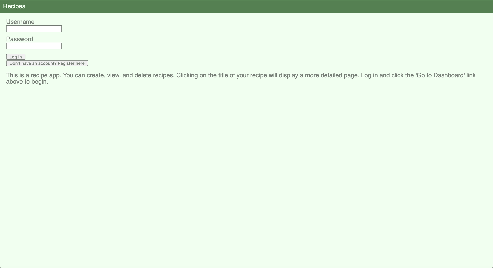
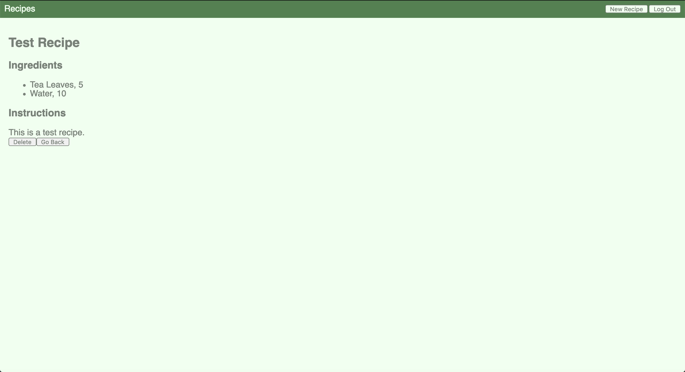
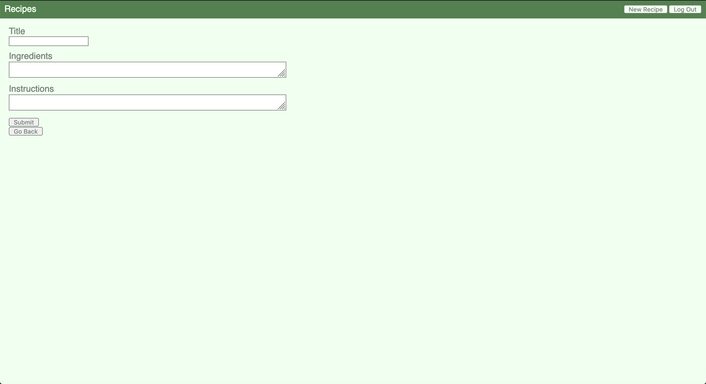

# Recipes App
### Deployed Version
The app is deployed [Here](https://sean-fullstack-client.herokuapp.com/)
The server is in a seperate repo that can be found [Here](https://github.com/thinkful-ei26/sean-fullStack-server)

### Screenshots

### Description
This app is for creating, saving, and sharing recipes.
#### Tech Stack
The backend for this app is using NodeJS with express.  Authentication is handled using JWTs with passport.
The database is a mongo database, and it's hosted on [mLab](https://mlab.com/).
The client is using React and Redux.
The server and client are both hosted on [Heroku](https://www.heroku.com/).
#### Code Base
Components are located in src/components.  The root component (App.js) is just in src/.  Most components are accessed on the dashboard, which decides which components to render by checking various conditions on the store.
All actions are located in src/actions.  And all Reducers are in src/reducers.  The root reducer (index.js) is what is exported to store.js, and it collects all other reducers into a single reducer.
On the backend, the root is server.js.  All other code is stored in seperate directories with an index.js file that just imports everything relevant from other files in the directory and export them in one place.  
The auth directory handles logins and refreshing jwts in the router, and the strategies defines the localStrategy and JWTStrategy.
The users directory contains one route that handles registering a new user.  This directory also contains a mongoose model that defines what a user looks like in the database.  This also includes a validatePassword method and a hashPassword static function that uses bcryptjs.
The recipes directory contains routes for CRUD operations on recipes and also contains a mongoose model defining recipes in the database.
The recipeLists directory also contains routes for CRUD operations and a mongoose model.  These are for collections of recipes.
